# เริ่มต้นใช้งาน TSTVN | Getting Started with TSTVN

**[ภาษาไทย](#ภาษาไทย) | [English](#english)**

คู่มือนี้พาตั้งแต่ดาวน์โหลด TSTVN v1.1.0 ไปจนถึงส่งเกมที่ส่งออกแล้วให้คนอื่นเล่น
This guide goes from downloading TSTVN v1.1.0 to sharing a game you exported.

---

## ภาษาไทย

> ภาพหน้าจอในคู่มือนี้ใช้หน้าจอภาษาอังกฤษ ชื่อปุ่มจึงเขียนเป็นภาษาอังกฤษ และมีชื่อภาษาไทยในวงเล็บ
> ถ้าตั้งโปรแกรมเป็นภาษาไทย ปุ่มจะแสดงตามชื่อในวงเล็บ เปลี่ยนภาษาได้ที่ **Language (ภาษา)** มุมขวาบนของหน้าเริ่มต้น

### ส่วนที่ 1: ดาวน์โหลดและติดตั้ง

#### 1. เปิดหน้า Releases อย่างเป็นทางการ

ไปที่ <https://github.com/xxxzas12/TST-Visual-Novel-Maker/releases/latest>
หน้านี้เป็นหน้า Release ล่าสุดของโครงการ ตอนนี้คือ **TSTVN v1.1.0**

ดาวน์โหลด TSTVN จากหน้านี้เท่านั้น อย่าดาวน์โหลดจากเว็บอื่นหรือไฟล์ที่มีคนส่งต่อมา

#### 2. ดาวน์โหลดไฟล์ติดตั้งที่ถูกต้อง

ในหัวข้อ **Assets** ของหน้า Release ให้คลิก **`TSTVN-Setup-1.1.0.exe`** (ประมาณ 112 MB)

ไฟล์ **Source code (zip / tar.gz)** เป็นซอร์สโค้ดสำหรับนักพัฒนา ไม่ใช่โปรแกรมที่ติดตั้งได้ ไม่ต้องดาวน์โหลด

#### 3. ตรวจสอบไฟล์ด้วย SHA-256 checksum

1. เปิดโฟลเดอร์ที่มีไฟล์ (ปกติคือ **Downloads**)
2. คลิกขวาที่พื้นที่ว่างในโฟลเดอร์ เลือก **Open in Terminal** (หรือเปิด PowerShell แล้วไปที่โฟลเดอร์นั้น)
3. พิมพ์คำสั่งนี้แล้วกด Enter:

   ```powershell
   Get-FileHash .\TSTVN-Setup-1.1.0.exe -Algorithm SHA256
   ```
4. เทียบค่าในช่อง `Hash` กับค่าที่เผยแพร่ในหน้า Release v1.1.0:

   ```text
   77C5897358B806A24D5483093E3F02FE83DB67319D01E7DA1917F7ED4FB39C76
   ```

ถ้าตรงกันทุกตัวอักษร แปลว่าไฟล์ตรงกับที่โครงการเผยแพร่ ถ้าไม่ตรง **อย่าเปิดไฟล์** ให้ลบทิ้งแล้วดาวน์โหลดใหม่จากหน้า Releases
checksum ยืนยันแค่ว่าไฟล์ตรงกับที่เผยแพร่ ไม่ได้รับประกันความปลอดภัยด้วยตัวมันเอง

#### 4. ติดตั้งโปรแกรม

1. ดับเบิลคลิก `TSTVN-Setup-1.1.0.exe` (ถ้าเห็นหน้าต่าง SmartScreen ดูข้อ 5 ก่อน)
2. ในหน้า **Install TSTVN** เลือกว่าจะให้สร้าง **Create Desktop shortcut** และ **Create Start Menu icon** หรือไม่
3. บรรทัด **Installs to:** แสดงตำแหน่งติดตั้ง คือ `%LOCALAPPDATA%\Programs\TSTVN` ของผู้ใช้คนปัจจุบัน
   ไม่ต้องใช้สิทธิ์ผู้ดูแลระบบ
4. กด **Install** แล้วรอจนเห็น **✓ Installed successfully**

ถ้าเคยติดตั้งเวอร์ชันเก่า ตัวติดตั้งจะอัปเกรดทับให้ โปรเจกต์ที่สร้างไว้ไม่ถูกลบ
ถอนการติดตั้งได้จาก Windows **Settings → Apps**

#### 5. ถ้า Windows SmartScreen แสดงคำเตือน

> **หมายเหตุเกี่ยวกับ Windows SmartScreen**
>
> เมื่อเปิดไฟล์ติดตั้ง TSTVN Windows อาจแสดงหน้าต่าง Microsoft Defender SmartScreen แจ้งว่า Windows protected your PC เนื่องจากโปรแกรมอาจยังไม่มีชื่อเสียงหรือใบรับรองการลงนามโค้ดที่ Windows รู้จัก
>
> หากดาวน์โหลดไฟล์จาก GitHub Releases อย่างเป็นทางการของโครงการ และตรวจสอบว่าเป็นไฟล์ที่ถูกต้องแล้ว ให้ทำตามขั้นตอนนี้:
>
> 1. คลิก **More info (ข้อมูลเพิ่มเติม)**
> 2. ตรวจสอบชื่อโปรแกรมและผู้เผยแพร่ที่แสดง หากมีข้อมูล
> 3. หากคุณเชื่อถือไฟล์และต้องการติดตั้ง ให้คลิก **Run anyway (เรียกใช้ต่อไป)**
>
> **ข้อควรระวัง:** อย่ากด Run anyway กับไฟล์ที่ไม่ทราบแหล่งที่มา หากไม่แน่ใจ ให้ยกเลิกการติดตั้งก่อน และตรวจสอบไฟล์จากหน้า GitHub Releases อย่างเป็นทางการ รวมถึงค่า SHA-256 checksum ที่โครงการเผยแพร่ไว้ ทั้งนี้ checksum ช่วยตรวจสอบความตรงกันของไฟล์ แต่ไม่ได้รับประกันว่าไฟล์ปลอดภัยโดยตัวมันเอง

ข้อมูลเพิ่มเติม:

- ตัวติดตั้ง TSTVN v1.1.0 ยังไม่ได้ลงนามดิจิทัล (code signing) คำเตือนนี้เกิดจากเหตุผลนั้น ไม่ได้แปลว่า Windows ตรวจพบไวรัส
  แต่ก็ไม่ได้แปลว่าไฟล์ใด ๆ ที่ไม่มีลายเซ็นจะปลอดภัยเสมอ
- ช่องผู้เผยแพร่ (Publisher) อาจแสดงเป็น **Unknown publisher** เพราะไฟล์ยังไม่ได้ลงนาม
- ข้อความและปุ่มอาจแตกต่างกันตามเวอร์ชันและการตั้งค่าของ Windows หรือโปรแกรมป้องกันไวรัสที่ใช้

#### 6. เปิด TSTVN

ในหน้าสุดท้ายของตัวติดตั้ง กด **Launch TSTVN** (หรือกด **Close** แล้วเปิดภายหลังจาก Desktop หรือ Start Menu)

จะเห็นหน้าเริ่มต้น **Create Your First Visual Novel**:

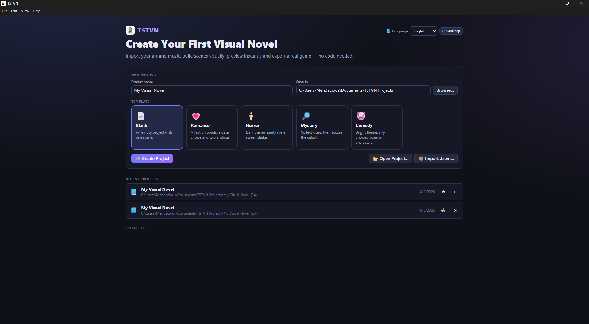

- **Language (ภาษา):** เลือกภาษาของหน้าจอโปรแกรม (ไทย / English)
- **⚙ Settings (ตั้งค่า):** ตั้งค่าโปรแกรม เช่น ธีมมืด/สว่าง ฟอนต์ บันทึกอัตโนมัติ
- **Recent projects (โปรเจกต์ล่าสุด):** โปรเจกต์ที่เปิดล่าสุด คลิกเพื่อเปิดต่อ

### ส่วนที่ 2: สร้างเกมแรก

ตัวอย่างในคู่มือนี้: เกมสั้น ๆ ที่มีฉากหลัง ตัวละครหนึ่งคน บทพูดสองสามบรรทัด และตัวเลือกสองทางที่พาไปคนละฉากจบ

#### 7. สร้างโปรเจกต์ใหม่

ในหน้าเริ่มต้น:

1. **Project name (ชื่อโปรเจกต์):** ตั้งชื่อ เช่น `My First Story`
2. **Save in (บันทึกที่):** โฟลเดอร์ที่จะเก็บโปรเจกต์ ค่าเริ่มต้นคือ `Documents\TSTVN Projects` กด **Browse… (เลือก…)** เพื่อเปลี่ยน
3. **Template (เทมเพลต):** เลือก **Blank** (โปรเจกต์ว่างมีหนึ่งฉาก) หรือเทมเพลตตัวอย่าง **Romance**, **Horror**, **Mystery**, **Comedy**
4. กด **✨ Create Project (สร้างโปรเจกต์)**

โปรแกรมจะเปิดหน้าแก้ไขฉาก แถบซ้ายสุดมีหน้าหลักของโปรแกรม:
**Scenes (ฉาก)**, **Story Flow (เส้นเรื่อง)**, **Assets (ไฟล์)**, **Characters (ตัวละคร)**, **Variables (ตัวแปร)**,
**Themes (ธีม)**, **Project (โปรเจกต์)**, **Export (ส่งออก)**, **Backups (สำรองข้อมูล)**

ปุ่มอื่นในหน้าเริ่มต้น: **📂 Open Project… (เปิดโปรเจกต์…)** เปิดโฟลเดอร์โปรเจกต์ที่มีอยู่ และ
**📦 Import .tstvn… (นำเข้า .tstvn…)** เปิดแพ็กเกจโปรเจกต์ `.tstvn` ที่ส่งออกจาก TSTVN

#### 8. นำเข้าภาพ เพลง และตัวละคร

ไปที่ **Assets (ไฟล์)**:

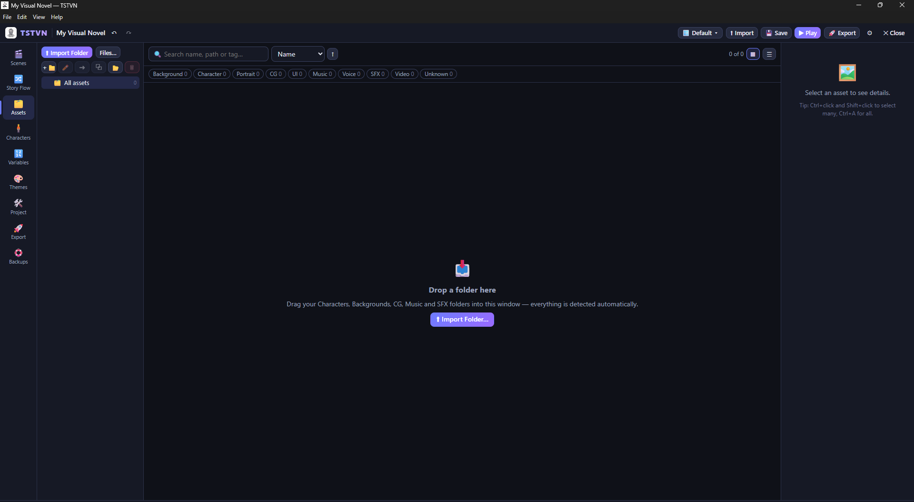

- กด **⬆ Import Folder (นำเข้าโฟลเดอร์)** เพื่อนำเข้าทั้งโฟลเดอร์ หรือ **Files… (ไฟล์…)** เพื่อเลือกทีละไฟล์
- หรือลากโฟลเดอร์จาก File Explorer มาวางในหน้าต่าง (**Drop a folder here**)

TSTVN แยกประเภทให้อัตโนมัติจากชื่อโฟลเดอร์ เช่น `Backgrounds` / `bg` / `ฉาก` เป็นฉากหลัง,
`Characters` / `sprites` / `ตัวละคร` เป็นภาพตัวละคร, `CG`, `UI`, `Music` / `bgm` / `เพลง` เป็นเพลง,
`Voice` เป็นเสียงพากย์ และ `SFX` / `SE` เป็นเสียงประกอบ แก้ประเภทเองภายหลังได้

ตัวอย่างโครงสร้างโฟลเดอร์ที่แนะนำ:

```text
MyAssets/
├─ Backgrounds/   classroom.png, park.jpg
├─ Characters/
│  └─ Alice/      normal.png, smile.png, sad.png
├─ Music/         theme.mp3
└─ SFX/           door.wav
```

ถ้านำเข้าโฟลเดอร์แบบ `Characters/<ชื่อตัวละคร>/<สีหน้า>.png` TSTVN จะสร้างตัวละครพร้อมสีหน้าให้อัตโนมัติ
หรือไปที่ **Characters (ตัวละคร)** แล้วกด **＋ New Character (ตัวละครใหม่)** หรือ **📁 Create from Folder… (สร้างจากโฟลเดอร์…)**

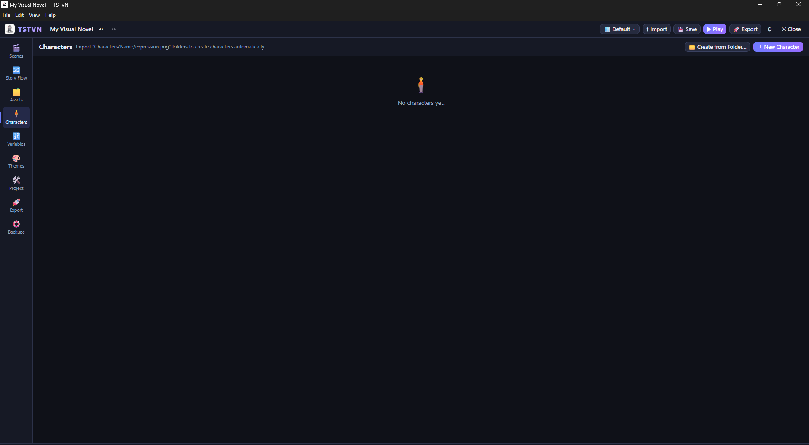

ไฟล์ที่รองรับ:

- ภาพ: png, jpg, jpeg, webp, gif, bmp, avif, svg
- เสียง: mp3, ogg, wav, m4a, aac, flac, opus, weba
- วิดีโอ: mp4, webm, ogv, m4v, mov

#### 9. สร้างฉากและบทพูด

ไปที่ **Scenes (ฉาก)**:

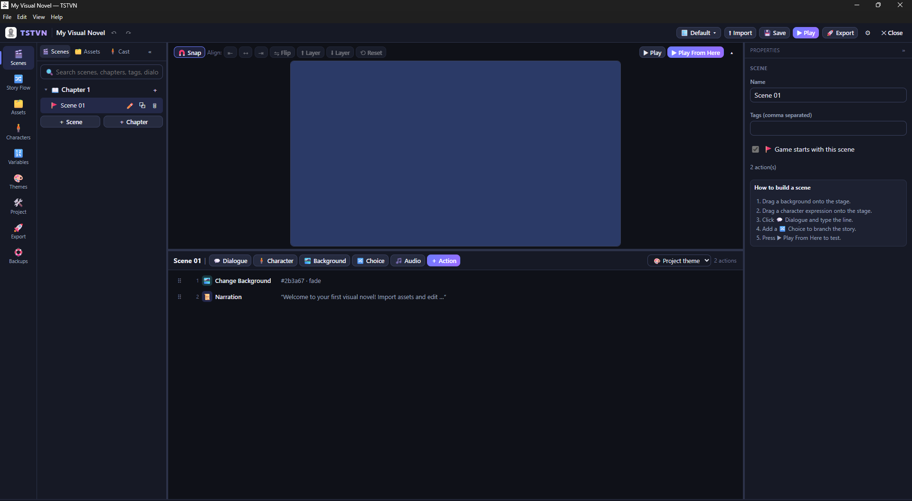

- ด้านซ้าย: รายการบทและฉาก กด **＋ Scene (ฉาก)** เพื่อเพิ่มฉาก หรือ **＋ Chapter (บท)** เพื่อเพิ่มบท
  ฉากที่มีธง 🚩 คือฉากแรกของเกม (ตั้งได้ที่ **Game starts with this scene (เกมเริ่มที่ฉากนี้)** ในแผงขวา)
- ตรงกลาง: เวที (ภาพตัวอย่างของฉาก) และรายการแอ็กชันของฉากด้านล่าง
- ด้านขวา: **Properties** ของสิ่งที่เลือก

แอ็กชันจะทำงานตามลำดับจากบนลงล่าง ลากที่ ⠿ เพื่อสลับลำดับได้ ปุ่มเพิ่มแอ็กชันอยู่เหนือรายการ:
**Dialogue (บทพูด)**, **Character (ตัวละคร)**, **Background (ฉากหลัง)**, **Choice (ตัวเลือก)**, **Audio (เสียง)** และ
**＋ Action (แอ็กชัน)** สำหรับแอ็กชันทั้งหมด (ค้นหาได้ และแบ่งหมวด Story, Visual, Character, Audio, Flow, Variable, Game, Templates)

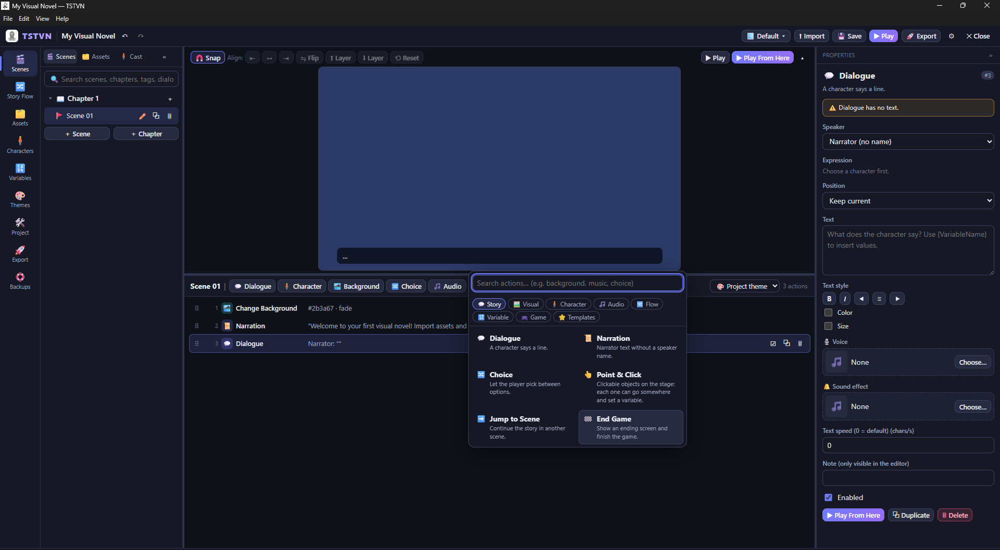

ลองทำตามตัวอย่าง:

1. **ฉากหลัง:** ลากภาพฉากหลังจากแท็บ **Assets** ของแผงซ้ายมาวางบนเวที หรือกด **Background (ฉากหลัง)** แล้วเลือกภาพ
2. **ตัวละคร:** ลากภาพสีหน้าของตัวละครจากแท็บ **Cast (นักแสดง)** มาวางบนเวที แล้วลากเพื่อจัดตำแหน่ง
3. **บทพูด:** กด **Dialogue (บทพูด)** แล้วในแผงขวา
   - **Speaker (ผู้พูด):** เลือกตัวละคร หรือ *Narrator (no name)* สำหรับคำบรรยาย
   - **Expression (สีหน้า)** และ **Position (ตำแหน่ง):** เลือกได้ถ้าต้องการ
   - **Text (ข้อความ):** พิมพ์บทพูด ใส่ค่าตัวแปรในข้อความได้ด้วย `{ชื่อตัวแปร}`
4. เพิ่มบทพูดอีกสองสามบรรทัด

#### 10. เพิ่มตัวเลือกและผลของตัวเลือก

1. สร้างฉากจบสองฉากก่อน (กด **＋ Scene** สองครั้ง ตั้งชื่อเช่น `Good Ending` และ `Bad Ending` ใส่บทพูดและแอ็กชัน **End Game (จบเกม)** ในแต่ละฉาก)
2. กลับไปฉากแรก กด **Choice (ตัวเลือก)**
3. ในแผงขวา แต่ละ **Option (ตัวเลือก)** มี
   - ช่องข้อความตัวเลือก เช่น "ไปสวนสาธารณะ"
   - **Goes to (ไปที่):** เลือก **Scene… (ฉาก…)** แล้วเลือกฉากปลายทาง หรือ **Continue (next action) (ไปต่อ (แอ็กชันถัดไป))**
   - **＋ Show only if… (แสดงเฉพาะเมื่อ…):** แสดงตัวเลือกเฉพาะเมื่อเงื่อนไขเป็นจริง
   - **＋ When chosen, also… (เมื่อถูกเลือก ให้…):** สิ่งที่เกิดขึ้นเมื่อผู้เล่นเลือก ได้แก่ **Set a variable (ตั้งค่าตัวแปร)**,
     **Add to a number variable (บวกค่าตัวแปรตัวเลข)**, **Play a sound (เล่นเสียง)**, **Animate a character (ใส่แอนิเมชันให้ตัวละคร)**
     และ **Screen effect (เอฟเฟกต์หน้าจอ)**
4. กด **＋ Add option (เพิ่มตัวเลือก)** ถ้าต้องการมากกว่าที่มี

ตัวแปร เช่น คะแนนความชอบ สร้างได้ที่ **Variables (ตัวแปร)** → **＋ New Variable**

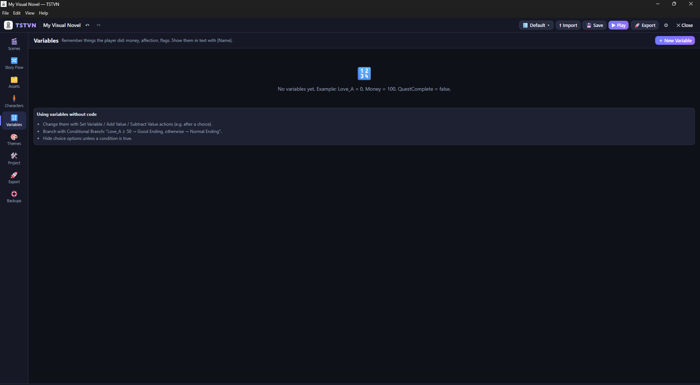

ดูภาพรวมของทุกฉากและการเชื่อมต่อได้ที่ **Story Flow (เส้นเรื่อง)** ถ้ามีจุดเชื่อมที่เสีย จะมีรายการแจ้งให้

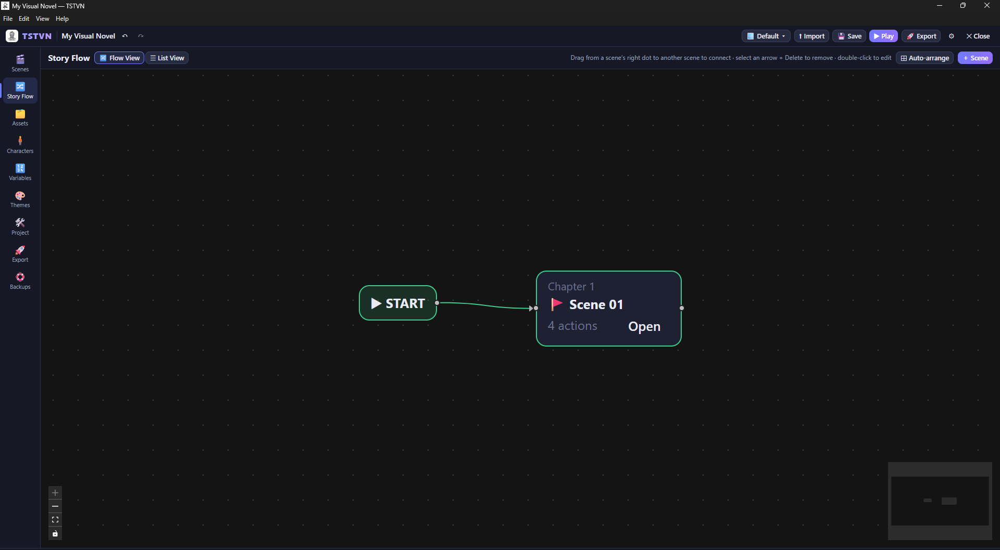

#### 11. ปรับหน้าตากล่องบทพูดและปุ่มตัวเลือก

ไปที่ **Themes (ธีม)** (หัวข้อหน้า **Game UI & Themes (หน้าตาเกม (UI) และธีม)**):

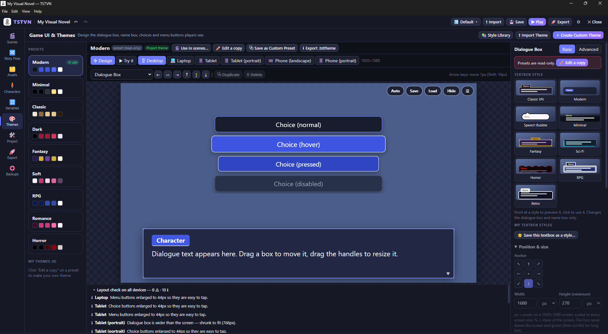

1. ซ้าย: **Presets** ธีมสำเร็จรูป (Modern, Minimal, Classic, Dark, Fantasy, Soft, RPG, Romance, Horror ฯลฯ)
2. ธีมสำเร็จรูปแก้ไขโดยตรงไม่ได้ กด **✏️ Edit a copy (แก้ไขสำเนา)** เพื่อสร้างธีมของคุณเอง
   หรือ **＋ Create Custom Theme (สร้างธีมเอง)**
3. เลือกส่วนที่จะแก้จากรายการเหนือภาพตัวอย่าง เช่น **Dialogue Box (กล่องบทพูด)** หรือ **Choice Buttons (ปุ่มตัวเลือก)**
   แล้วปรับในแผงขวา มีโหมด **Basic (พื้นฐาน)** และ **Advanced (ขั้นสูง)**
4. **Textbox style:** ชี้เพื่อดูตัวอย่าง คลิกเพื่อใช้ (Classic VN, Modern, Speech Bubble, Minimal, Fantasy, Sci-Fi, Horror, RPG, Retro)
5. ลากกล่องบนภาพตัวอย่างเพื่อย้าย และลากมุมเพื่อปรับขนาด แถบด้านบนเปลี่ยนขนาดจอตัวอย่างได้
   (**Desktop**, **Laptop**, **Tablet**, **Phone** ฯลฯ) และ **▶ Try it (ลองเล่น)** เพื่อลองกดจริง
6. ใช้ธีมกับทั้งเกมด้วย **✓ Use for whole project (ใช้กับทั้งโปรเจกต์)** หรือเฉพาะบางฉากด้วย **🎬 Use in scenes… (ใช้กับฉาก…)**

ถ้าต้องการใช้สไตล์เดิมซ้ำหลายธีม ใช้ **Style Library (คลังสไตล์)** ที่มุมขวาบน

#### 12. ทดลองเล่นเกม

- **▶ Play (เล่น)** ที่แถบบน หรือกด **F5:** เล่นจากหน้าแรกของเกม
- **▶ Play From Here (เล่นจากตรงนี้)** หรือกด **Shift+F5:** เล่นจากแอ็กชันที่เลือก เหมาะกับการทดสอบเฉพาะจุด

เกมจะเปิดในหน้าต่างตัวอย่าง ปิดหน้าต่างเพื่อกลับมาแก้ไข

#### 13. บันทึกโปรเจกต์และบันทึกอัตโนมัติ

- กด **Save (บันทึก)** ที่แถบบน หรือ **Ctrl+S**
- แถบสถานะด้านล่างแสดง **● Unsaved changes (ยังไม่ได้บันทึก)**, **✓ Saved (บันทึกแล้ว)** หรือ **✓ Autosaved (บันทึกอัตโนมัติแล้ว)**
- **บันทึกอัตโนมัติ:** ค่าเริ่มต้นบันทึกให้ 2 นาทีหลังจากมีการแก้ไขที่ยังไม่บันทึก ปรับหรือปิดได้ที่
  **⚙ Settings → Autosave & recovery (บันทึกอัตโนมัติและกู้คืน)** (ใส่ 0 = ปิด)
- **กู้คืนเมื่อโปรแกรมปิดผิดปกติ:** เปิดอยู่เสมอ งานที่ยังไม่บันทึกจะถูกคัดลอกทุก 10 วินาที และเสนอให้กู้คืนเมื่อเปิดโปรเจกต์ครั้งถัดไป
- **Backups (สำรองข้อมูล):** โปรแกรมสำรองโปรเจกต์ให้ก่อนการกระทำที่เสี่ยง ดูและกู้คืนได้ที่หน้า **Backups**

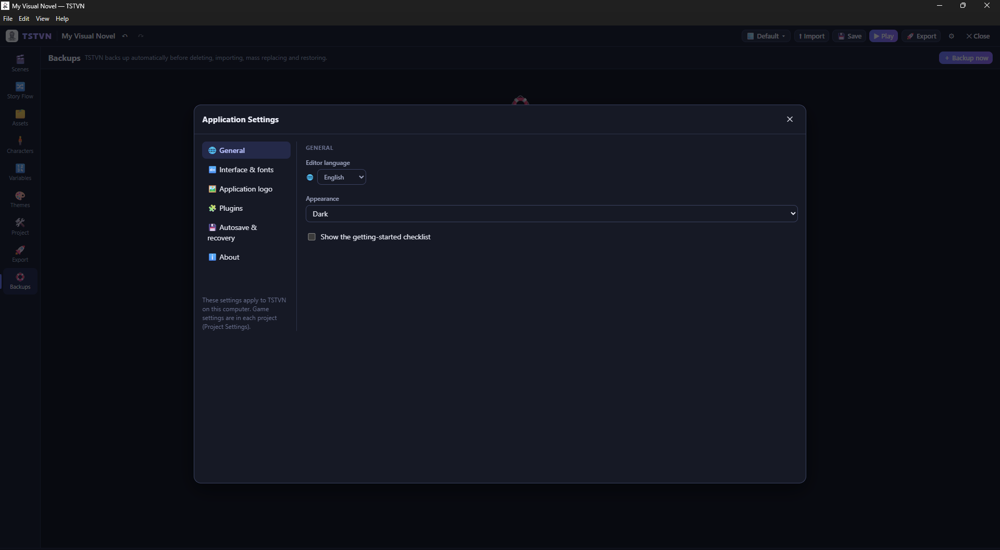

ตั้งชื่อเกม ฉากเริ่มต้น ความละเอียด ภาษาของเกม และไอคอนเกมได้ที่ **Project (โปรเจกต์)**:

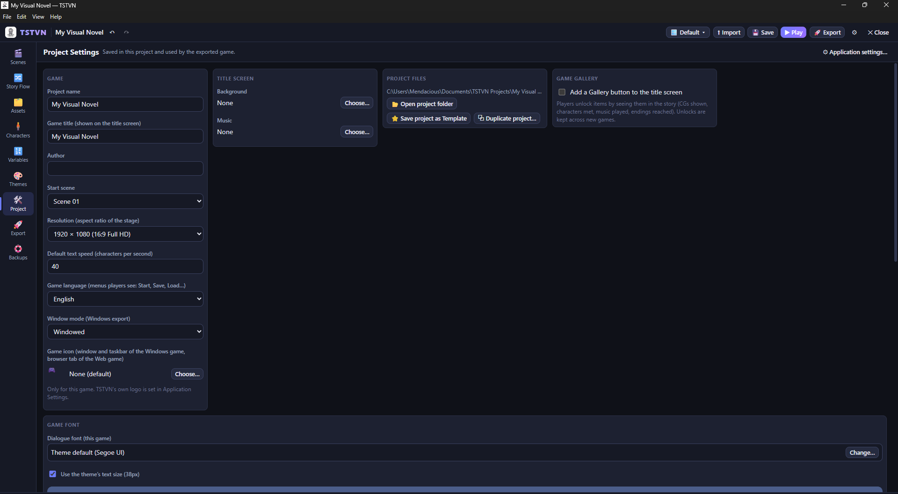

### ส่วนที่ 3: ส่งออกและแชร์เกม

> **การส่งออกเกม ≠ การสร้างตัวติดตั้ง TSTVN**
> หน้า **Export** สร้าง *เกมของคุณ* ให้ผู้เล่นเปิดได้ ไม่เกี่ยวกับไฟล์ `TSTVN-Setup-*.exe` ซึ่งเป็นตัวติดตั้งของโปรแกรม TSTVN เอง
> (ตัวติดตั้งนั้นสร้างโดยผู้พัฒนาด้วย `npm run dist` ดู [GUIDE.md](GUIDE.md) ผู้ใช้ทั่วไปไม่ต้องทำ)

#### 14. ส่งออกเกม

ไปที่ **Export (ส่งออก)**:

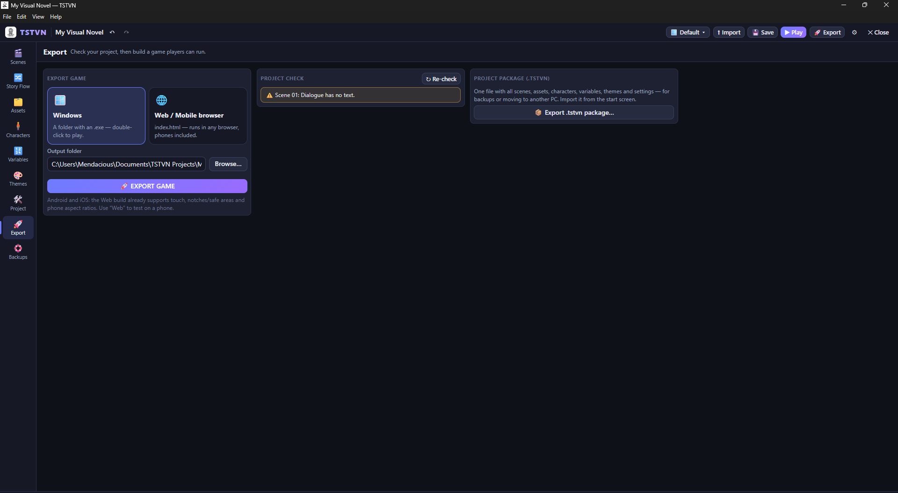

1. ดูกล่อง **Project check (ตรวจโปรเจกต์)** ทางขวา
   - ⛔ **ข้อผิดพลาด** ต้องแก้ก่อน ไม่อย่างนั้นส่งออกไม่ได้ (คลิกที่รายการเพื่อไปยังจุดที่มีปัญหา)
   - ⚠️ **คำเตือน** ส่งออกได้ แต่ควรตรวจดู
   - กด **↻ Re-check (ตรวจอีกครั้ง)** หลังแก้
2. ในกล่อง **Export Game (ส่งออกเกม)** เลือกรูปแบบ:
   - **🪟 Windows:** โฟลเดอร์ที่มีไฟล์ `.exe` ดับเบิลคลิกเพื่อเล่น
   - **🌐 Web / Mobile browser:** `index.html` เล่นในเบราว์เซอร์ได้ รวมถึงบนมือถือ
3. **Output folder (โฟลเดอร์ปลายทาง):** เลือกที่เก็บด้วย **Browse… (เลือก…)**
4. กด **🚀 EXPORT GAME (ส่งออกเกม)** แล้วรอแถบความคืบหน้า

เมื่อเสร็จจะเห็น **✅ Done — export verified (เสร็จแล้ว — ตรวจสอบไฟล์ที่ส่งออกเรียบร้อย)** พร้อมจำนวนไฟล์ ขนาด และตำแหน่งไฟล์
ถ้าล้มเหลวจะเห็น **⛔ Export Failed (ส่งออกไม่สำเร็จ)** และจะไม่มีไฟล์ถูกเขียนลงโฟลเดอร์ปลายทาง

รูปแบบที่รองรับมีแค่ **Windows** และ **Web / Mobile browser** TSTVN สร้างแอป Android/iOS หรือเกมสำหรับ macOS/Linux โดยตรงไม่ได้
(ถ้าต้องการเล่นบนมือถือ ให้ใช้แบบ Web)

#### 15. หาไฟล์ที่ส่งออก

กด **📂 Open Folder (เปิดโฟลเดอร์)** ในกล่องผลลัพธ์ หรือเปิดโฟลเดอร์ปลายทางเอง ชื่อโฟลเดอร์มาจากชื่อเกมใน **Project**:

| รูปแบบ | โฟลเดอร์ | ข้างในมี |
|---|---|---|
| Windows | `<ชื่อเกม>-Windows` | `<ชื่อเกม>.exe` และไฟล์ประกอบอื่น ๆ (ประมาณ 370 MB) |
| Web | `<ชื่อเกม>-Web` | `index.html`, `game.js`, `runtime.js`, `runtime.css`, `README.txt` และโฟลเดอร์ `assets` |

#### 16. ทดสอบเกมที่ส่งออก

- กด **▶ Run Game (เปิดเกม)** ในกล่องผลลัพธ์ หรือดับเบิลคลิก `<ชื่อเกม>.exe` (Windows)
- แบบ Web: ดับเบิลคลิก `index.html` เพื่อเปิดในเบราว์เซอร์
- เล่นให้ครบทุกเส้นทาง ลองทุกตัวเลือก และตรวจว่าภาพและเสียงครบ
- ถ้ามีเวลา ลองบนเครื่องอื่นที่ไม่ได้ติดตั้ง TSTVN

#### 17. แพ็กและแชร์เกม

**Windows:**

- ต้องส่ง **ทั้งโฟลเดอร์** `<ชื่อเกม>-Windows` ไม่ใช่แค่ไฟล์ `.exe` (ไฟล์ `.exe` เปิดเองโดยไม่มีไฟล์อื่นในโฟลเดอร์ไม่ได้)
- วิธีง่ายที่สุด: คลิกขวาที่โฟลเดอร์ → **Compress to ZIP file** แล้วส่งไฟล์ .zip (เช่น ผ่าน Google Drive หรือ itch.io)
- ผู้เล่นแตกไฟล์ .zip แล้วดับเบิลคลิก `<ชื่อเกม>.exe` ไม่ต้องติดตั้ง TSTVN หรือโปรแกรมอื่นเพิ่ม
- ไฟล์ `.exe` ของเกมยังไม่ได้ลงนามดิจิทัล ผู้เล่นจึงอาจเห็น SmartScreen แจ้งเตือนได้เหมือนข้อ 5 ควรบอกผู้เล่นไว้ล่วงหน้า

**Web:**

- อัปโหลด **ทั้งโฟลเดอร์** `<ชื่อเกม>-Web` (รวม `assets`) ขึ้นเว็บโฮสต์ใดก็ได้ เช่น itch.io (แบบ HTML), GitHub Pages หรือ Netlify
  แล้วให้ผู้เล่นเปิดลิงก์ของ `index.html`
- ส่งเป็น .zip ให้ผู้เล่นแตกไฟล์แล้วเปิด `index.html` เองได้เช่นกัน

**ส่งโปรเจกต์ (ไม่ใช่เกม) ให้คนอื่นแก้ต่อ:** ใช้ **📦 Export .tstvn package…** ที่หน้า **Export** แล้วอีกฝ่ายเปิดด้วย **📦 Import .tstvn…** ในหน้าเริ่มต้น

#### 18. แก้ปัญหาที่พบบ่อย

| ปัญหา | วิธีแก้ |
|---|---|
| SmartScreen ขึ้นตอนติดตั้ง | ดู [ข้อ 5](#5-ถ้า-windows-smartscreen-แสดงคำเตือน) ตรวจ checksum ก่อนตัดสินใจ |
| ค่า checksum ไม่ตรง | อย่าเปิดไฟล์ ลบทิ้งแล้วดาวน์โหลดใหม่จากหน้า Releases ถ้ายังไม่ตรงให้ [แจ้งบั๊ก](https://github.com/xxxzas12/TST-Visual-Novel-Maker/issues/new?template=bug_report.yml) |
| ปุ่ม **🚀 EXPORT GAME** ส่งออกไม่ได้ | ดู **Project check** ทางขวา แก้รายการ ⛔ ทั้งหมด แล้วกด **↻ Re-check** |
| ภาพหรือเสียงหายในเกม | ไฟล์ต้นฉบับถูกย้ายหรือลบ ดูรายการไฟล์ที่หายในหน้า **Export** แล้วนำเข้าใหม่ หรือนำออกจากโปรเจกต์ |
| ตัวเลือกไม่ไปฉากที่ต้องการ | ตรวจ **Goes to** ของตัวเลือก และดูรายการจุดเชื่อมที่เสียใน **Story Flow** |
| ส่งเกมให้เพื่อนแล้วเปิดไม่ได้ | ต้องส่งทั้งโฟลเดอร์ `<ชื่อเกม>-Windows` ไม่ใช่แค่ไฟล์ .exe |
| เกม Web เปิดแล้วว่างเปล่า | ตรวจว่าโฟลเดอร์ `assets` และไฟล์ `.js` อยู่ข้าง `index.html` ครบ และอัปโหลดทั้งโฟลเดอร์ |
| โปรแกรมปิดเองระหว่างทำงาน | เปิดโปรเจกต์อีกครั้ง TSTVN จะเสนอให้กู้คืนงานที่ยังไม่บันทึก หรือดูหน้า **Backups** |
| เปิด TSTVN จาก Terminal แล้วไม่ขึ้น | Terminal บางตัว (เช่นใน VS Code) ตั้งค่า `ELECTRON_RUN_AS_NODE` ไว้ ให้เปิดจาก Start Menu, Desktop หรือ Explorer แทน ดู [KNOWN_ISSUES.md](../KNOWN_ISSUES.md) |

ปัญหาอื่น ๆ ดู [KNOWN_ISSUES.md](../KNOWN_ISSUES.md) หรือ [แจ้งบั๊ก](https://github.com/xxxzas12/TST-Visual-Novel-Maker/issues/new?template=bug_report.yml)

---

## English

> The screenshots show the English interface. In the Thai section, labels are given in English with the Thai
> label in brackets. Change the editor language with **Language** at the top right of the welcome screen.

### Part 1: Download and install

#### 1. Open the official Releases page

Go to <https://github.com/xxxzas12/TST-Visual-Novel-Maker/releases/latest>. It always shows the project's latest
release, currently **TSTVN v1.1.0**.

Only download TSTVN from this page, not from other websites or from files someone forwarded to you.

#### 2. Download the correct installer

Under **Assets** on the release page, click **`TSTVN-Setup-1.1.0.exe`** (about 112 MB).

**Source code (zip / tar.gz)** is for developers and cannot be installed. You don't need it.

#### 3. Verify the file with its SHA-256 checksum

1. Open the folder with the file (usually **Downloads**).
2. Right-click an empty area and choose **Open in Terminal** (or open PowerShell and go to that folder).
3. Run:

   ```powershell
   Get-FileHash .\TSTVN-Setup-1.1.0.exe -Algorithm SHA256
   ```
4. Compare the `Hash` value with the one published on the v1.1.0 release page:

   ```text
   77C5897358B806A24D5483093E3F02FE83DB67319D01E7DA1917F7ED4FB39C76
   ```

If every character matches, the file is the one the project published. If not, **don't run it**: delete it and
download it again from the Releases page. A checksum proves the file matches what was published; it does not by
itself prove the file is safe.

#### 4. Install

1. Double-click `TSTVN-Setup-1.1.0.exe` (if a SmartScreen window appears, read step 5 first).
2. On the **Install TSTVN** page, choose whether to **Create Desktop shortcut** and **Create Start Menu icon**.
3. **Installs to:** shows the location, `%LOCALAPPDATA%\Programs\TSTVN` for the current user. No administrator
   rights are needed.
4. Click **Install** and wait for **✓ Installed successfully**.

An older version is upgraded in place, and your projects are not touched. Uninstall from Windows
**Settings → Apps**.

#### 5. If Windows SmartScreen shows a warning

> **Note about Windows SmartScreen**
>
> When you open the TSTVN installer, Microsoft Defender SmartScreen may display a “Windows protected your PC” warning if the application has limited reputation or does not have a code-signing certificate recognized by Windows.
>
> If you downloaded the installer from the project's official GitHub Releases page and have verified that it is the expected file:
>
> 1. Click **More info**.
> 2. Check the application name and publisher information, if available.
> 3. If you trust the file and want to proceed, click **Run anyway**.
>
> **Warning:** Never bypass SmartScreen for files from unknown sources. If you are unsure, cancel the installation and verify the installer using the official GitHub Releases page and the published SHA-256 checksum. A matching checksum confirms file integrity against the published value, but does not by itself guarantee that the file is safe.

Also note:

- The TSTVN v1.1.0 installer is not code-signed yet, which is why this warning can appear. The warning does not
  mean Windows found a virus, but an unsigned file is not automatically safe either.
- The publisher may be shown as **Unknown publisher** because the file is not signed.
- The exact wording and buttons can differ between Windows versions, settings and antivirus software.

#### 6. Launch TSTVN

On the installer's last page, click **Launch TSTVN** (or **Close**, and start it later from the Desktop or
Start Menu).

You'll see the welcome screen, **Create Your First Visual Novel**:


- **Language:** the editor language (Thai / English).
- **⚙ Settings:** application settings such as dark/light mode, fonts and autosave.
- **Recent projects:** click one to continue working on it.

### Part 2: Make your first game

The example: a short game with a background, one character, a few lines of dialogue and a choice leading to
two different endings.

#### 7. Create a project

On the welcome screen:

1. **Project name:** for example `My First Story`.
2. **Save in:** where the project folder goes. The default is `Documents\TSTVN Projects`; click **Browse…** to change it.
3. **Template:** **Blank** (an empty project with one scene) or a sample: **Romance**, **Horror**, **Mystery**, **Comedy**.
4. Click **✨ Create Project**.

The scene editor opens. The left bar has the main views: **Scenes**, **Story Flow**, **Assets**, **Characters**,
**Variables**, **Themes**, **Project**, **Export**, **Backups**.

Also on the welcome screen: **📂 Open Project…** opens an existing project folder, and **📦 Import .tstvn…**
opens a `.tstvn` project package exported from TSTVN.

#### 8. Import pictures, music and characters

Open **Assets**:


- **⬆ Import Folder** imports a whole folder; **Files…** picks single files.
- Or drag a folder from File Explorer into the window (**Drop a folder here**).

Types are detected from folder names: `Backgrounds` / `bg` are backgrounds, `Characters` / `sprites` are character
pictures, `CG`, `UI`, `Music` / `bgm` are music, `Voice` is voice and `SFX` / `SE` are sound effects. Thai folder
names such as `ฉาก`, `ตัวละคร` and `เพลง` work too. You can change a type later.

A suggested layout:

```text
MyAssets/
├─ Backgrounds/   classroom.png, park.jpg
├─ Characters/
│  └─ Alice/      normal.png, smile.png, sad.png
├─ Music/         theme.mp3
└─ SFX/           door.wav
```

Importing `Characters/<Name>/<expression>.png` creates the characters and their expressions automatically. You
can also open **Characters** and use **＋ New Character** or **📁 Create from Folder…**.


Supported files:

- Images: png, jpg, jpeg, webp, gif, bmp, avif, svg
- Audio: mp3, ogg, wav, m4a, aac, flac, opus, weba
- Video: mp4, webm, ogv, m4v, mov

#### 9. Create scenes and dialogue

Open **Scenes**:


- Left: chapters and scenes. **＋ Scene** adds a scene, **＋ Chapter** a chapter. The scene with the 🚩 flag is
  where the game starts (set it with **Game starts with this scene** in the right panel).
- Middle: the stage (a preview of the scene) and the scene's action list below it.
- Right: **Properties** of whatever is selected.

Actions run from top to bottom; drag ⠿ to reorder them. The buttons above the list add actions:
**Dialogue**, **Character**, **Background**, **Choice**, **Audio**, and **＋ Action** for everything else
(searchable, grouped into Story, Visual, Character, Audio, Flow, Variable, Game and Templates).


Try it:

1. **Background:** drag a background from the left panel's **Assets** tab onto the stage, or click **Background** and pick a picture.
2. **Character:** drag an expression from the **Cast** tab onto the stage, then drag it into position.
3. **Dialogue:** click **Dialogue**, then in the right panel:
   - **Speaker:** a character, or *Narrator (no name)* for narration;
   - **Expression** and **Position:** optional;
   - **Text:** the line. Insert a variable's value with `{VariableName}`.
4. Add a few more lines.

#### 10. Add a choice and what it does

1. First create two ending scenes (**＋ Scene** twice, e.g. `Good Ending` and `Bad Ending`, each with some
   dialogue and an **End Game** action).
2. Go back to the first scene and click **Choice**.
3. In the right panel, each **Option** has:
   - the option text, e.g. "Go to the park";
   - **Goes to:** choose **Scene…** and pick the target scene, or **Continue (next action)**;
   - **＋ Show only if…:** show the option only when a condition is true;
   - **＋ When chosen, also…:** what happens when it's picked: **Set a variable**, **Add to a number variable**,
     **Play a sound**, **Animate a character** or **Screen effect**.
4. Click **＋ Add option** for more options.

Create variables, such as affection points, in **Variables** → **＋ New Variable**.


**Story Flow** shows all scenes and how they connect, and lists any broken connections.


#### 11. Customize the dialogue box and choice buttons

Open **Themes** (the view is titled **Game UI & Themes**):


1. Left: **Presets** (Modern, Minimal, Classic, Dark, Fantasy, Soft, RPG, Romance, Horror…).
2. Presets can't be edited directly. Click **✏️ Edit a copy** to make your own theme, or **＋ Create Custom Theme**.
3. Pick what to edit from the list above the preview, such as **Dialogue Box** or **Choice Buttons**, and adjust it
   in the right panel. **Basic** shows the essentials; **Advanced** shows everything.
4. **Textbox style:** point at a style to preview it, click to use it (Classic VN, Modern, Speech Bubble, Minimal,
   Fantasy, Sci-Fi, Horror, RPG, Retro).
5. Drag boxes on the preview to move them and drag the handles to resize. The bar above switches the preview size
   (**Desktop**, **Laptop**, **Tablet**, **Phone**…), and **▶ Try it** lets you click through it.
6. Apply the theme to the whole game with **✓ Use for whole project**, or to some scenes with **🎬 Use in scenes…**.

To reuse a style across themes, use the **Style Library** at the top right.

#### 12. Preview the game

- **▶ Play** in the top bar, or **F5**: play from the title screen.
- **▶ Play From Here**, or **Shift+F5**: play from the selected action, handy for testing one part.

The game opens in a preview window. Close it to return to editing.

#### 13. Save, and how autosave works

- Click **Save** in the top bar, or press **Ctrl+S**.
- The status bar at the bottom shows **● Unsaved changes**, **✓ Saved** or **✓ Autosaved**.
- **Autosave:** by default the project is saved 2 minutes after the first unsaved change. Change or turn it off in
  **⚙ Settings → Autosave & recovery** (0 = off).
- **Crash recovery** is always on: unsaved work is copied every 10 seconds and offered back when you open the
  project after a crash.
- **Backups:** TSTVN backs the project up before risky operations. View and restore them in **Backups**.


Set the game title, start scene, resolution, game language and game icon in **Project**:


### Part 3: Export and share

> **Exporting a game ≠ building the TSTVN installer**
> **Export** builds *your game* for players. It has nothing to do with `TSTVN-Setup-*.exe`, which installs the
> TSTVN editor itself. That installer is built by the developers with `npm run dist` (see [GUIDE.md](GUIDE.md));
> regular users never need to.

#### 14. Export the game

Open **Export**:


1. Check the **Project check** box on the right:
   - ⛔ **errors** must be fixed or export won't run (click an item to jump to it);
   - ⚠️ **warnings** don't block export, but are worth reading;
   - click **↻ Re-check** after fixing.
2. Under **Export Game**, choose a target:
   - **🪟 Windows:** a folder with an `.exe`; double-click to play.
   - **🌐 Web / Mobile browser:** `index.html`; runs in any browser, phones included.
3. **Output folder:** choose where with **Browse…**.
4. Click **🚀 EXPORT GAME** and wait for the progress bar.

On success you'll see **✅ Done — export verified** with the file count, size and location. On failure you'll see
**⛔ Export Failed**, and nothing is written to the output folder.

Only **Windows** and **Web / Mobile browser** are supported. TSTVN does not build native Android/iOS apps or
macOS/Linux games. For phones, use the Web export.

#### 15. Find the exported files

Click **📂 Open Folder** in the result box, or open the output folder yourself. The folder name comes from the game
title in **Project**:

| Target | Folder | Contents |
|---|---|---|
| Windows | `<Game>-Windows` | `<Game>.exe` plus its runtime files (about 370 MB) |
| Web | `<Game>-Web` | `index.html`, `game.js`, `runtime.js`, `runtime.css`, `README.txt` and an `assets` folder |

#### 16. Test the exported game

- Click **▶ Run Game** in the result box, or double-click `<Game>.exe` (Windows).
- Web: double-click `index.html` to open it in a browser.
- Play every route, try every choice, and check that all pictures and sounds are there.
- If you can, also try it on another PC that doesn't have TSTVN.

#### 17. Package and share your game

**Windows:**

- Share **the whole `<Game>-Windows` folder**, not only the `.exe`, which can't run without the other files.
- Easiest: right-click the folder → **Compress to ZIP file**, and share the .zip (e.g. Google Drive or itch.io).
- Players unzip it and double-click `<Game>.exe`. They don't need TSTVN or anything else installed.
- The game's `.exe` is not code-signed, so players may also see a SmartScreen warning like in step 5. Tell them in
  advance.

**Web:**

- Upload **the whole `<Game>-Web` folder** (including `assets`) to any web host, such as itch.io (HTML game),
  GitHub Pages or Netlify, and share the link to `index.html`.
- You can also share it as a .zip; players unzip it and open `index.html`.

**Sharing the project (not the game) with another creator:** use **📦 Export .tstvn package…** in **Export**; they
open it with **📦 Import .tstvn…** on the welcome screen.

#### 18. Troubleshooting

| Problem | What to do |
|---|---|
| SmartScreen appears during install | See [step 5](#5-if-windows-smartscreen-shows-a-warning). Verify the checksum before deciding. |
| The checksum doesn't match | Don't run the file. Delete it and download again from the Releases page. If it still doesn't match, [report a bug](https://github.com/xxxzas12/TST-Visual-Novel-Maker/issues/new?template=bug_report.yml). |
| **🚀 EXPORT GAME** fails | Look at **Project check**, fix every ⛔ item, then click **↻ Re-check**. |
| Pictures or sounds are missing in the game | The original files were moved or deleted. The **Export** view lists missing files; import them again or remove them. |
| A choice goes to the wrong place | Check the option's **Goes to**, and the broken-connection list in **Story Flow**. |
| A friend can't open the game | Share the whole `<Game>-Windows` folder, not only the .exe. |
| The Web game is blank | Make sure the `assets` folder and `.js` files are next to `index.html`, and upload the whole folder. |
| TSTVN closed unexpectedly | Open the project again; TSTVN offers to recover unsaved work. Also see **Backups**. |
| TSTVN doesn't open when started from a terminal | Some terminals (e.g. VS Code's) set `ELECTRON_RUN_AS_NODE`. Start TSTVN from the Start Menu, Desktop or Explorer instead. See [KNOWN_ISSUES.md](../KNOWN_ISSUES.md). |

For anything else, see [KNOWN_ISSUES.md](../KNOWN_ISSUES.md) or
[report a bug](https://github.com/xxxzas12/TST-Visual-Novel-Maker/issues/new?template=bug_report.yml).
